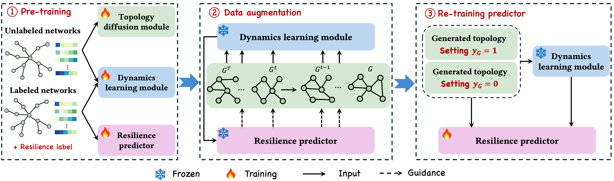
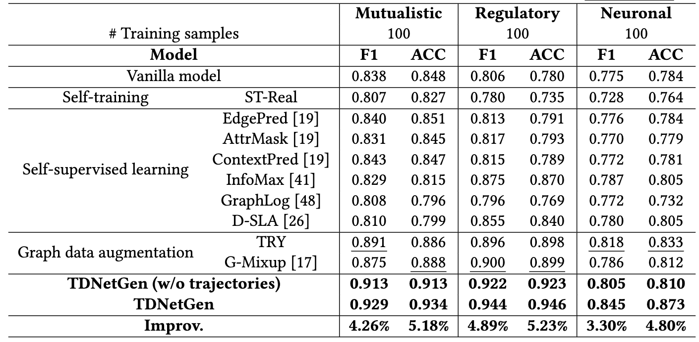

# TDNetGen


Predicting the resilience of complex networks, which represents the ability to retain fundamental functionality amidst external perturbations or internal failures, plays a critical role in understanding and improving real-world complex systems. In this paper, we introduce a novel resilience prediction framework for predicting resilience, designed to tackle this issue through generative data augmentation of network topology and dynamics. The core idea is the strategic utilization of the inherent joint distribution present in unlabeled data, facilitating the learning process of the resilience predictor by illuminating the relationship between network topology and dynamics. Experiment results on three network datasets demonstrate that our proposed framework TDNetGen can achieve high prediction accuracy up to 85%-95%.

## Installation

### Environment

- Tested OS: Linux
- Python >= 3.10.9
- PyTorch == 1.13.0
- hydra == 1.1
- PyTorchLightning == 1.7.2

### Training

Place download the [dataset](https://www.dropbox.com/scl/fo/qstti53fezl6f139zyzzq/h?rlkey=o1gfyfyly0xafe4b11lsy9d2b&dl=0) from Dropbox, and put the dataset into the corresponding `data` folder.

Step 1. To train the resilience predictor of TDNetGen, run (For example, mutualistic dataset)
```
cd ode
python train_ode_semi_stage.py dataset=mutualistic
```
The results will be saved at `ode/outputs`.

Step 2. To train the topology diffusion module of TDNetGen, run (For example, mutualistic dataset)
```
cd diff_model
python main.py dataset=mutualistic
```
The results will be saved `diff_model/outputs`.

Step 3. To use the resilience predictor to guide the topology diffusion module, run
```
cd diff_model
python main.py general.use_guidance=True dataset=mutualistic general.guidance_direction=1 # for positive smaples
python main.py general.use_guidance=True dataset=mutualistic general.guidance_direction=0 # for negative smaples
```
The results will be saved `diff_model/outputs/**/graph_adjs/enhance_pos.pt` and `diff_model/outputs/**/graph_adjs/enhance_neg.pt`.


Step 4. To use the genetated samples to retrain the resilience predictor, run
```
cd ode
python train_ode_semi_stage.py dataset=mutualistic general.test_only=True general.re_train=True
```
The results will be saved `diff_model/outputs`.

## Performance

- Our framework effectively empowers predictive performance via generative augmentation of both topology and dynamics.
- Self-training cannot universally guarantee a positive impact on model performance.
- Extracting knowledge from unlabeled data via hand-crafted self-supervised tasks offers marginal benefits to the resilience prediction.

We use F1-score and accuracy (ACC) to measure the performance of models. It is worth noting that all the metrics are the higher the better.




## License

The software in this repository is freely available under MIT license. Please see the [license](https://github.com/tsinghua-fib-lab/TDNetGen/blob/main/LICENSE.txt) for further details.
